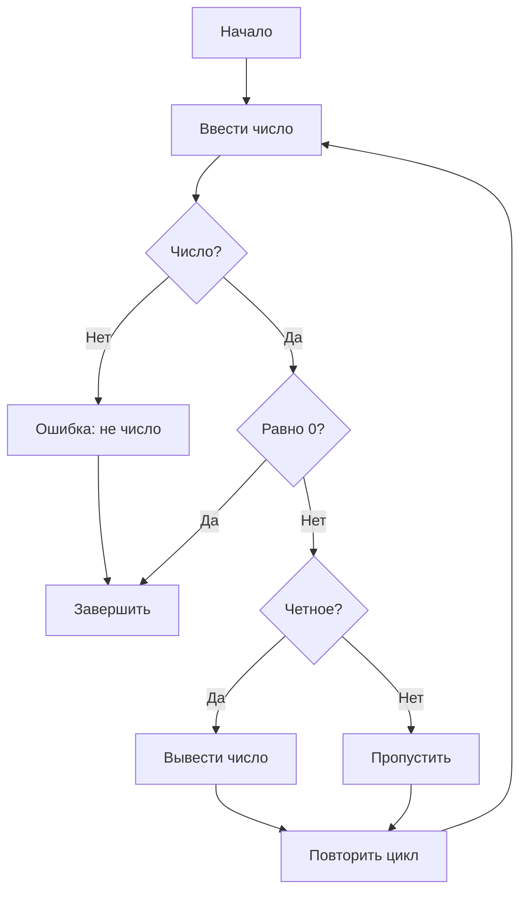

```mermaid
graph TD
    A[Начало] --> B[Ввести число]
    B --> C{Число?}
    C -->|Нет| D[Ошибка: не число]
    D --> E[Завершить]
    C -->|Да| F{Равно 0?}
    F -->|Да| E
    F -->|Нет| G{Четное?}
    G -->|Да| H[Вывести число]
    G -->|Нет| I[Пропустить]
    H --> J[Повторить цикл]
    I --> J
    J --> B
```